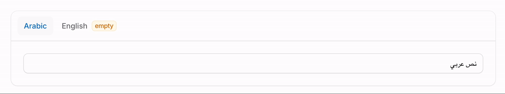
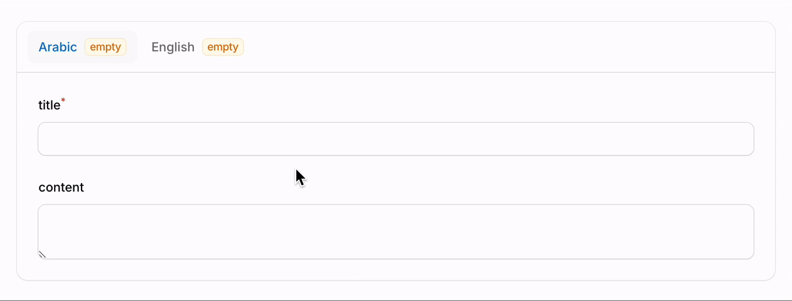

# Filament Translatable Tabs

[](https://packagist.org/packages/abdulmajeed-jamaan/filament-translatable-tabs)
[](https://github.com/abdulmajeed-jamaan/filament-translatable-tabs/actions?query=workflow%3Arun-tests+branch%3Amain)
[](https://github.com/abdulmajeed-jamaan/filament-translatable-tabs/actions?query=workflow%3A"fix+php+code+style+issues"+branch%3Amain)
[](https://packagist.org/packages/abdulmajeed-jamaan/filament-translatable-tabs)

Automatically generate tabs for translations.

This was created to be used with [spatie/laravel-translatable](https://github.com/spatie/laravel-translatable), but it can be used standalone as well.





## Installation

You can install the package via composer:

```bash
composer require abdulmajeed-jamaan/filament-translatable-tabs
```

Then in any registered service provider `boot()` method configure the following:

Configure default locales labels:

```php
use AbdulmajeedJamaan\FilamentTranslatableTabs\TranslatableTabs;

TranslatableTabs::configureLocalesLabelsUsing([
    'ar' => 'Arabic',
    'en' => 'English'
    // It's better to have a locale file: 'ar' => __('localeFile.ar')
]);
```

Configure default locales:

```php
use AbdulmajeedJamaan\FilamentTranslatableTabs\TranslatableTabs;

TranslatableTabs::configureLocalesUsing([
    'ar' ,
    'en' 
]);
```

## Usage

### Single Field

```php
use Filament\Forms\Components\TextInput;

TextInput::make('title')
    ->translatableTabs();
```

### Multiple Fields

```php
use AbdulmajeedJamaan\FilamentTranslatableTabs\TranslatableTabs;

TranslatableTabs::make('anyLabel')
    ->schema([
        Forms\Components\TextInput::make("title"),
        Forms\Components\Textarea::make("content")
    ]);
```

### Configurations (optionally)

#### Default

In any registered service provider `boot()` method optionally configure the following:

```php
use AbdulmajeedJamaan\FilamentTranslatableTabs\TranslatableTabs;
use Filament\Forms\Components\Tabs\Tab;
use Filament\Forms\Components\Field;

TranslatableTabs::configureUsing(function (TranslatableTabs $component){
    // ...
});

TranslatableTabs::configureTabsUsing(function (Tab $component, $locale){
    // ...
});

TranslatableTabs::configureFieldsUsing(function (Field $component, $locale){
    // ...
});
```

#### Override the defaults:

```php
use AbdulmajeedJamaan\FilamentTranslatableTabs\TranslatableTabs;
use Filament\Forms\Components\Field;
use Filament\Forms\Components\Tabs\Tab;
use Filament\Forms\Components\TextInput;

// Single Field
TextInput::make()
    ->translatableTabs(
        locales: function () {
            // you can override labels using : ['ar' => 'Arabic']
            return ['ar', 'en']
        },
        modifyTabsUsing: function (Tab $component, $locale){
            // ...
        },
        modifyFieldsUsing: function (Field $component, $locale){
            // ...
        } 
    )

// Multiple Fields
TranslatableTabs::make('anyLabel')
    ->locales(function () {
        // you can override labels using : ['ar' => 'Arabic']
        return ['ar', 'en']
    })
    ->modifyTabsUsing(function (Tab $component, $locale){
        // ...
    })
    ->modifyFieldsUsing(function (Field $component, $locale){
        // ...
    })
```

### Suggested configurations

In order to have similar experience to the [preview](#filament-translatable-tabs) set the following:

```php
use AbdulmajeedJamaan\FilamentTranslatableTabs\TranslatableTabs;
use Filament\Forms\Components\Field;
use Filament\Forms\Components\Tabs\Tab;


TranslatableTabs::configureTabsUsing(function (Tab $component) {
    $hasValue = fn ($tab, $get): bool => collect($tab->getChildComponents())
        ->contains(fn($c) => !empty($get($c->getName())));

    $component
        ->live(onBlur: true)
        ->badgeColor(function ($component, $get) use($hasValue) {
            return $hasValue($component, $get) ? 'primary' : 'warning';
        })
        ->badge(function ($component, $get) use($hasValue) {
            return $hasValue($component, $get) ? null : 'empty';
        }));
});

TranslatableTabs::configureFieldsUsing(function (Field $component, $locale) {
    $direction = str($locale)->startsWith('ar') ? 'rtl' : 'ltr'; 
    $component->extraAttributes(['style' => "direction: $direction;"], merge: true);
});
```


## Changelog

Please see [CHANGELOG](CHANGELOG.md) for more information on what has changed recently.

## Contributing

Please see [CONTRIBUTING](.github/CONTRIBUTING.md) for details.

## Security Vulnerabilities

Please review [our security policy](../../security/policy) on how to report security vulnerabilities.

## Credits

- [Abdulmajeed-Jamaan](https://github.com/Abdulmajeed-Jamaan)
- [All Contributors](../../contributors)

## License

The MIT License (MIT). Please see [License File](LICENSE.md) for more information.
